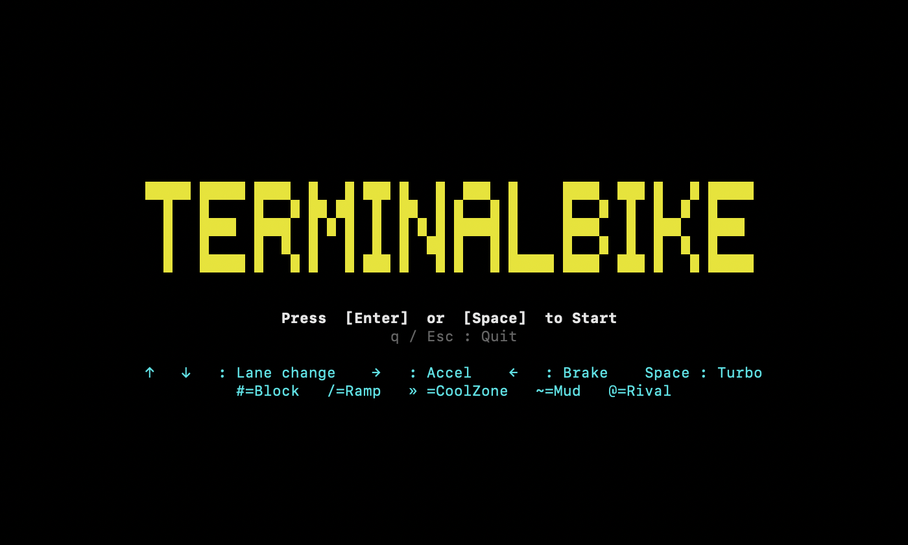
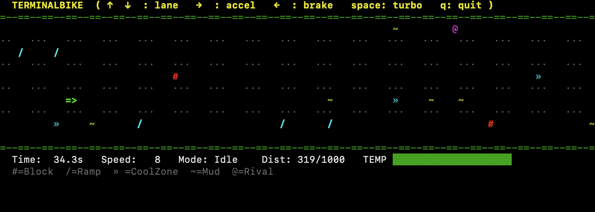

# Terminal Bike




Exciting bike racing game in your terminal.

## Install

Download the archive for your OS and architecture from the [Releases](https://github.com/j-un/terminalbike/releases) page, extract it, and place the `terminalbike` binary somewhere in your `PATH`.

#### macOS note

The released binaries are not code-signed, so macOS Gatekeeper may block execution with a message like "Apple could not verify `terminalbike` is free of malware". If you see this, either remove the quarantine attribute from the downloaded binary:

```sh
xattr -d com.apple.quarantine ./terminalbike
```

or build it yourself from source (see below).

### Build from source

Requires [Go](https://go.dev/) to be installed.

```sh
make build
```

## Run

```sh
terminalbike
```

Recommended terminal size: **80×24 or larger**. Wider screens are more fun!

## Controls

| Key             | Action      |
| --------------- | ----------- |
| ↑ / w / k       | Lane up     |
| ↓ / s / j       | Lane down   |
| → / d / l       | Accelerate  |
| ← / a / h       | Brake       |
| Space           | Turbo       |
| q / Esc         | Quit        |

## Objects

| Symbol | Meaning                                |
| ------ | -------------------------------------- |
| `#`    | Block — crash on contact               |
| `/`    | Ramp — jump over obstacles             |
| `»`    | Cool zone — instantly cools the engine |
| `~`    | Mud — resets speed to default          |
| `@`    | Rival — crash on contact               |
